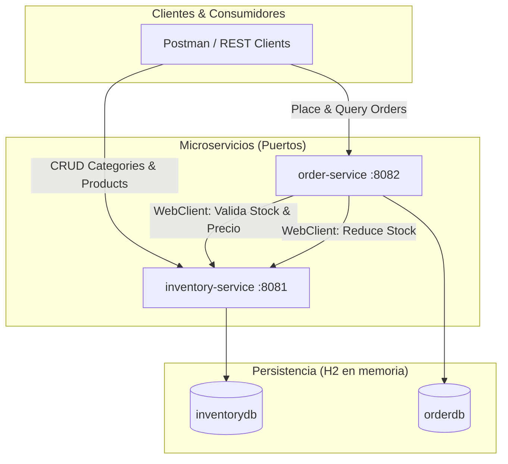

# Transformación Digital de EcoMarket SPA - Microservicios

Este proyecto representa la arquitectura de microservicios desarrollada para la transformación digital de **EcoMarket SPA**, una empresa chilena dedicada a la venta de productos ecológicos y sostenibles. La solución aborda los problemas de rendimiento y disponibilidad de la antigua aplicación monolítica mediante la separación de responsabilidades y la comunicación eficiente entre componentes independientes.

---

## 👥 Integrantes del Equipo
* **[Nombres de los estudiantes]**

---

## 🏗️ Arquitectura del Sistema

El sistema se diseñó bajo una arquitectura de microservicios estructurada en un proyecto multi-módulo de Gradle:



### 1. `inventory-service` (Puerto: `8081`)
* **Responsabilidad:** Gestión de categorías y catálogo de productos ecológicos.
* **Base de Datos:** H2 en memoria (`inventorydb`).
* **Migración:** Inicialización con Flyway a través de scripts de migración (`V1__initial_schema.sql` y `V2__insert_sample_data.sql`).
* **Relaciones JPA:** Relación `@OneToMany` (Category -> Products) y `@ManyToOne` (Product -> Category).

### 2. `order-service` (Puerto: `8082`)
* **Responsabilidad:** Procesamiento y registro de compras/órdenes de venta.
* **Base de Datos:** H2 en memoria (`orderdb`).
* **Migración:** Inicialización con Flyway (`V1__initial_schema.sql`).
* **Comunicación Externa:** Consume el endpoint de `inventory-service` vía **WebClient** con control de timeouts (5 segundos), mapeo de códigos HTTP y re-lanzamiento estructurado de excepciones.
* **Relaciones JPA:** Relación `@OneToMany` (Order -> OrderItems) y `@ManyToOne` (OrderItem -> Order).

---

## 🚀 Requisitos y Configuración de Base de Datos

El proyecto está configurado para ejecutarse localmente de forma inmediata:
* **Base de datos por defecto:** H2 en memoria para evitar requerir bases de datos locales complejas al docente.
* **Soporte PostgreSQL:** Las dependencias del driver PostgreSQL están incluidas en el `build.gradle` raíz. Para cambiar a una persistencia real en PostgreSQL, configure los detalles en los archivos `application.properties` correspondientes:
  ```properties
  spring.datasource.url=jdbc:postgresql://localhost:5432/ecomarket_db
  spring.datasource.username=postgres
  spring.datasource.password=su_contraseña
  spring.jpa.database-platform=org.hibernate.dialect.PostgreSQLDialect
  ```

---

## 🛠️ Tecnologías y Patrones Aplicados

1. **Persistencia JPA + Hibernate:** Implementación de entidades de dominio anotadas con definición estricta de PKs, FKs e integridad referencial.
2. **Patrón CSR (Controller-Service-Repository):** Separación rigurosa de responsabilidades.
3. **Bean Validation (JSR 380):** Validaciones en controladores sobre DTOs (`@NotBlank`, `@Email`, `@Positive`, `@Min`, `@NotEmpty`, `@Valid`) retornando respuestas consistentes.
4. **Manejo Centralizado de Excepciones (@ControllerAdvice):** Manejo de excepciones locales y externas con respuestas en JSON estructurado (`ErrorResponse`) y HTTP status correctos.
5. **Logs estructurados con SLF4J:** Trazabilidad en consola en todas las capas del sistema ante operaciones CRUD, creación de órdenes y errores.
6. **Módulo de Pruebas e Integración:** Colección de Postman exportada en la raíz del proyecto.

---

## 📋 Endpoints Disponibles

### Microservicio de Inventario (`inventory-service`)
* `GET /api/categories` - Obtener todas las categorías.
* `GET /api/categories/{id}` - Obtener categoría por ID.
* `POST /api/categories` - Crear nueva categoría.
* `PUT /api/categories/{id}` - Actualizar categoría existente.
* `DELETE /api/categories/{id}` - Eliminar categoría.
* `GET /api/products` - Obtener todos los productos.
* `GET /api/products/{id}` - Obtener producto por ID.
* `GET /api/products/category/{categoryId}` - Obtener productos de una categoría.
* `POST /api/products` - Crear nuevo producto.
* `PUT /api/products/{id}` - Actualizar producto.
* `DELETE /api/products/{id}` - Eliminar producto.
* `PUT /api/products/reduce-stock` - Endpoint interno para reducir el stock (consumido por `order-service`).

### Microservicio de Órdenes (`order-service`)
* `GET /api/orders` - Listar todas las órdenes procesadas.
* `GET /api/orders/{id}` - Obtener detalles de una orden por ID.
* `POST /api/orders` - Crear una nueva orden (valida stock y reduce cantidad en inventario en tiempo real).

---

## 🏃 Cómo Ejecutar el Proyecto

Abra una consola de comandos en la raíz del proyecto y ejecute los siguientes pasos:

### 1. Compilar y Construir el Proyecto
```powershell
./gradlew build
```

### 2. Iniciar el Microservicio de Inventario (`inventory-service`)
```powershell
./gradlew :inventory-service:bootRun
```
*El servicio iniciará en el puerto `8081`.*
*Puede acceder a la consola H2 en: `http://localhost:8081/h2-console` (JDBC URL: `jdbc:h2:mem:inventorydb`).*

### 3. Iniciar el Microservicio de Órdenes (`order-service`)
```powershell
./gradlew :order-service:bootRun
```
*El servicio iniciará en el puerto `8082`.*
*Puede acceder a la consola H2 en: `http://localhost:8082/h2-console` (JDBC URL: `jdbc:h2:mem:orderdb`).*

---

## 🧪 Pruebas de Integración con Postman

En la raíz del proyecto se encuentra el archivo **`EcoMarket.postman_collection.json`**. Puede importarlo en Postman para probar el flujo completo:
1. Crear categorías y productos.
2. Listar productos y verificar el stock inicial (ej: `Product ID: 1` con stock `50`).
3. Registrar una orden de compra en `order-service` para el `Product ID: 1` con cantidad `5`.
4. Verificar que la orden se creó correctamente en el puerto `8082` con estado `CONFIRMED`.
5. Consultar el producto en el puerto `8081` y observar que el stock se redujo automáticamente a `45`.
6. Intentar registrar otra orden solicitando una cantidad superior al stock disponible (ej: `50`) y comprobar la respuesta de error estructurado con código `400 Bad Request` y los logs del sistema.
